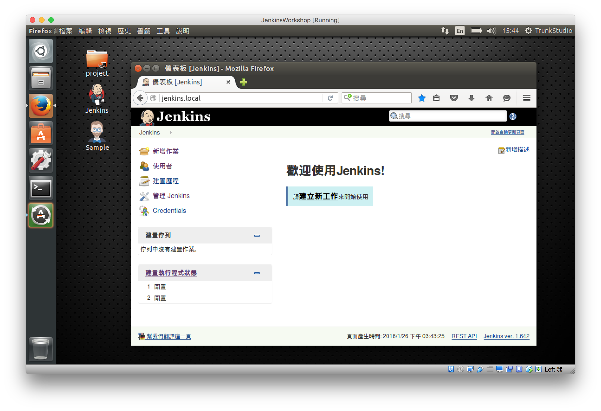

安裝設定
=======

建議讀者搭配 Ubuntu Linux 14.04.3 以方便測試。

因為 Ubuntu Linux 相容多數 Open Source 軟體，也被用於許多 Production Server 環境，因此使用 Ubuntu Linux 作為 Jenkins 入門的系統，可以避免很多干擾學習的問題發生。

建議搭配 VirtualBox 虛擬機器使用 Ubuntu Linux + Jenkins，我們也為學習者提供已安裝設定完成的 VirtualBox Image，請向課程主辦單位取得檔案下載位址。

如何選擇 Jenkins 運行環境?
---------------------------

儘管 Jenkins 可以跨平台，包括 Windows、Linux 或 Mac OS X 環境皆可執行；但是一般來說，我們還是盡可能選擇與 Testing / Production 相近的執行環境，包含作業系統、資料庫的版本等，以減少不必要的問題發生。

安裝 Java 相關工具
------------------

建議使用 JDK 8 以上版本。

### 安裝 JDK

```
sudo add-apt-repository ppa:openjdk-r/ppa
sudo apt-get update
sudo apt-get install openjdk-8-jdk
```

備註：如果無法使用 `add-apt-repository` 指令，請先安裝 `software-properties-common` 套件。

```
sudo apt-get update
sudo apt-get install software-properties-common
```

安裝完成後，檢查是否可以正常執行 `java` 與 `javac` 指令。

```
java -version
javac -version
```

### 設定 Java 預設版本

如果無法正確執行 Java 8 的版本，可以使用以下指令重新設定預設版本。

```
sudo update-alternatives --config java
sudo update-alternatives --config javac
```

### 安裝 Maven

本書許多範例使用 Maven 建置工具，因此建議先安裝 Maven 3.x 軟體。

```
sudo apt-get update
sudo apt-get install maven
```

安裝 Jenkins 軟體
-----------------

參考 Jenkins 官方提供的 Ubuntu Linux + Jenkins 安裝說明。

網址 - https://goo.gl/J4An8h

```
wget -q -O - https://jenkins-ci.org/debian/jenkins-ci.org.key\
 | sudo apt-key add -
sudo sh -c 'echo deb http://pkg.jenkins-ci.org/debian binary/\
 > /etc/apt/sources.list.d/jenkins.list'
sudo apt-get update
sudo apt-get install jenkins
```

管理 Jenkins 服務
----------------

使用 `apt-get` 指令安裝的 Jenkins，在開機後預設就會啟動服務。

使用瀏覽器打開網址測試 Jenkins 是否正常運作，預設的 Port 是 8080。

```
http://localhost:8080/
```




重新啟動 Jenkins 服務：

```
sudo service jenkins restart
```

停用 Jenkins 服務：

```
sudo service jenkins stop
```
