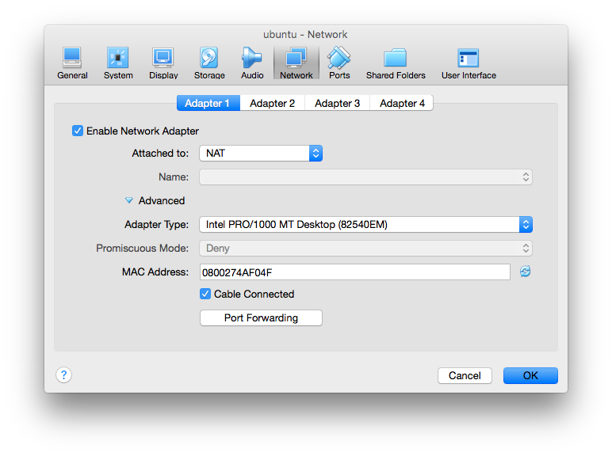

一般問題
========

VM 問題排解
-----------

上課時使用 VM Bridged Adapter network setting 但後來連不到，為了讓課程上的更順利，先改成 NAT 但如此 Host 就沒有辦法連到 Guest VM ，本來要用 Windows Cmder 進行相關操作，只好讓學員用 ubuntu 內的 terminal 進行操作。

後來查了一下資料，用 NAT 要連進 Guest VM 其實很簡單，只要設置一下 Port Forwarding 即可，如下：

給需要的人參考。

關於分支使用的策略
------------------

下面連結可以參考：

[COSCUP 開源工作坊: Git Workflows](https://github.com/hacking-thursday/coscup2015_workshop)

有更詳細的介紹。

希望 N 個 task 完成後才進行目標 task
------------------------------------

套件如下：

[Join Plugin](https://wiki.jenkins-ci.org/display/JENKINS/Join+Plugin)

environment 替換
----------------

套件如下：

[EnvInject Plugin](https://wiki.jenkins-ci.org/display/JENKINS/EnvInject+Plugin)

### Jenkins做為CI與CD功能，本身有沒有什麼API可以提供做為資訊揭露，有沒有實際使用這些API的例子

-	jenkins api doc: https://jenkinsapi.readthedocs.org/en/latest/using_jenkinsapi.html
-	https://www.npmjs.com/package/jenkins-api
-	之前的經驗會透過 CI 的 api 取得版本相關資訊
-	也可以搭配 Jenkins script console 執行 https://wiki.jenkins-ci.org/display/JENKINS/Jenkins+Script+Console

### Jenkins每次更新都會留下歷史記錄，目前有沒有什麼現有方法可以做house keeping的

jenkins 本身就可以設置希望可以保留多少 task，若要定期 archive 有相關的 plugin 可以處理

### 本身是Java project，有沒有推薦使用的plug-in以及如何離線安裝plug-in

-	config 相關
-	ssh 傳檔案相關
-	版本控制相關
-	task 管理相關
-	test report 相關
-	離線安裝透過 jenkins web UI 即可進行
-	在 command-line 模式可以這樣做：

Download the Plugin (*.hpi File) and put it in the following directory: %JENKINS_HOME%/plugins/

### 有可能Jenkins做完測試後，自動幫我回覆issue tracking system說已解嗎? 有plug-in解還是要自己寫code?

-	e.g. [Jenkins + Jira](https://wiki.jenkins-ci.org/display/JENKINS/JIRA+Plugin)

### 除了CI與CD外，Jenkins還可以做到什麼程度，譬如產報表?

-	測試覆蓋率報表
-	記錄每次發版的 change log
-	壓力測試報表
-	Unit Testing 報表: JUnit XML Report supported
-	自動監測服務狀態、...一些經常需要被重複執行的任務，特別是執行結果需要被記錄（或檢驗），只要能用 command-line / scripting 方式定義，就可以交給 Jenkins 來處理。

### 做CI與CD有什麼雷是千萬不要踩的，譬如說不要做在Production上?

-	準備一個跟 production 一樣的環境該環境除了拿來進行 preview 之外，在上 production 之前可以確認新的 deploy 有沒有其他潛在問題。
-	jenkins 建置所需 library 如 jdk 避免使用 jenkins 的套件安裝，為了 debug 方便，建議使用 jenkins linux user 環境設置進行相關套件引入。
-	CI 和 CD 只是開發流程的一環節，僅是輔助的用途。
