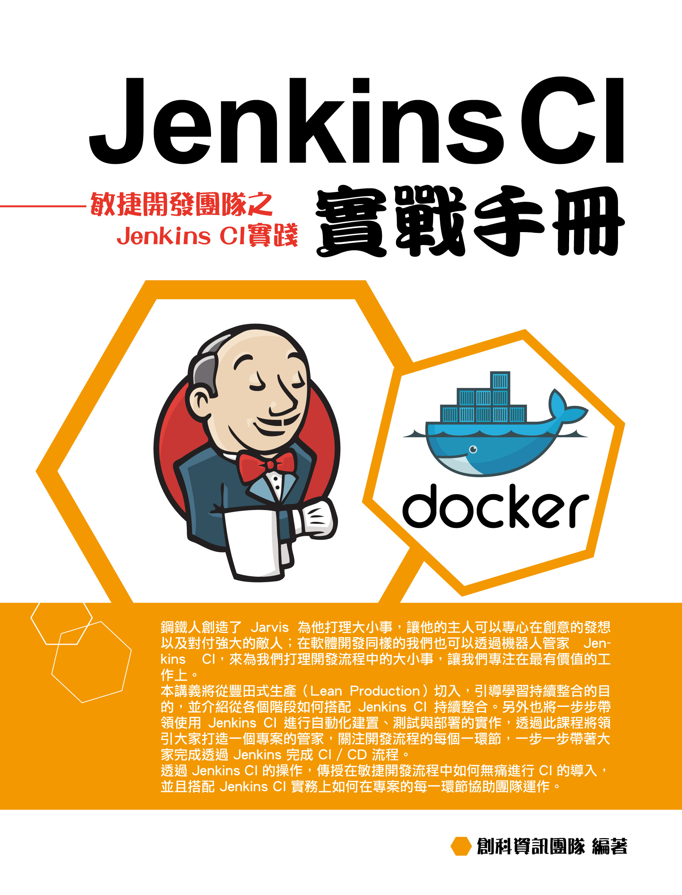

Jenkins CI 實戰手冊
====================

鋼鐵人創造了 Jarvis 為他打理大小事，讓他的主人可以專心在創意的發想以及對付強大的敵人；在軟體開發同樣的我們也可以透過機器人管家 Jenkins CI，來為我們打理開發流程中的大小事，讓我們專注在最有價值的工作上。

本講義將從豐田式生產（又稱為精實生產；Lean production ）切入，引導學習持續整合的目的，並介紹從各個階段如何搭配 Jenkins CI。另外也將一步步帶領使用 Jenkins CI 進行自動化建置、測試與部署的實作，透過此課程將領引大家打造一個專案的管家，關注開發流程的每個一環節，一步一步帶著大家完成透過 Jenkins 完成 Continuous Integration（持續整合）及 Continuous Delivery（持續交付；CD）流程。

透過 Jenkins CI 的操作，傳授在敏捷開發流程中如何無痛進行 CI 的導入，並且搭配 Jenkins CI 實務上如何在專案的每一環節協助團隊運作

閱讀須知
--------

本講義之飯粒實作皆搭配 Ubuntu Linux 作業系統，請於課前先向活動主辦單位取得 VirtualBox 虛擬機器映像檔。

### 適合對象

適合對開發流程自動化感興趣的 IT 從業人員，或是導入敏捷開發卻無法敏捷的團隊學習，適合不排斥在 Linux 命令列輸入指令的人，因為大部份自動化程序都需要透過命令列輸入指令執行。

本講義將針對 Web 相關應用如 Web Application、API Server 相關開發應用進行演示（因 App 開發流程與 Web 有所差異，特別提醒 App 開發者留意）講師本身熟悉 Java 以及 JavaScript 開發，因此課程將以 Node.js 範例專案進行演練，但實際 CI 的導入應用觀念與流程，可適用於大多數程式語言及開發工具。

講座與課程
----------

* 本講義使用於 iThome 舉辦之 [Jenkins 持續整合實戰講堂](http://devopsconf.ithome.com.tw/workshop/jenkins/index.html)
* 企業或學校辦理相關軟體開發培訓課程請聯繫 workshop@trunksys.com

講義作者
--------

Spooky

Kyle

版權所有：[創科資訊股份有限公司](http://trunk-studio.com/)
