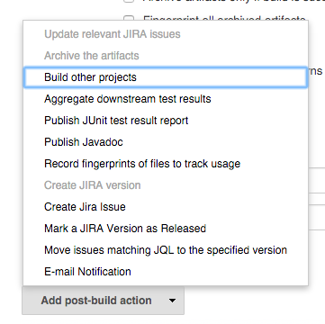
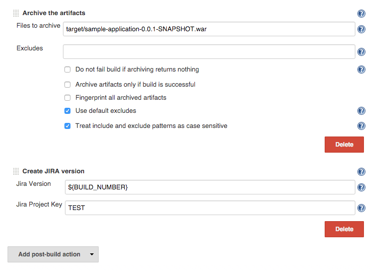
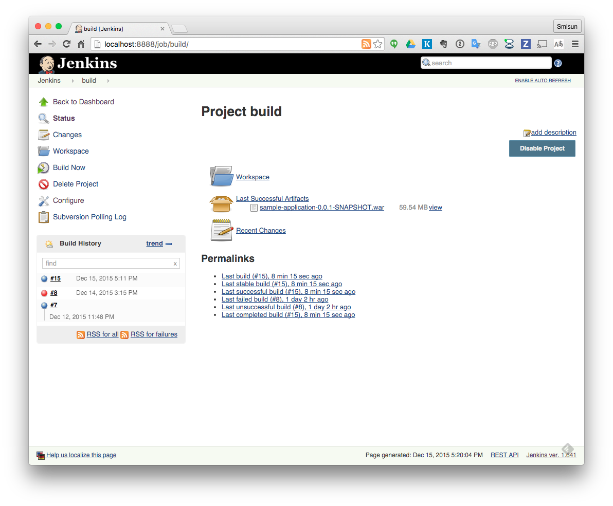
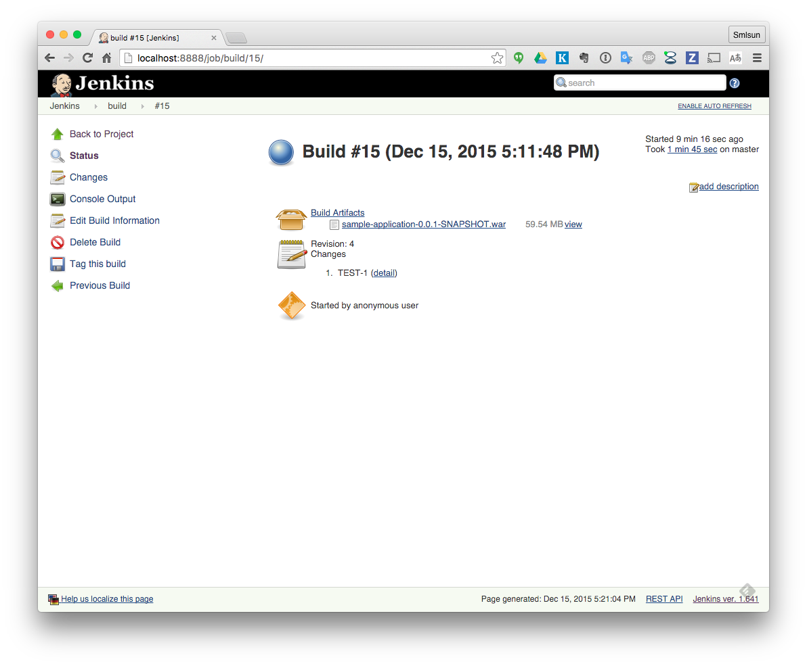

build archive
=============

Archive the artifacts
---------------------

參考下圖進行選曲

選擇 `Archive the artifacts` 此選項

設置要封存的檔案
----------------

此例而言，我們可以填入 `target/sample-application-0.0.1-SNAPSHOT.war`

透過 `mvn -Pprod package` 此指令將會產生上述檔案

檢視封存結果
------------

### overview

### task

可以看到 jenkins 將會提供連結讓使用者可以進行下載
