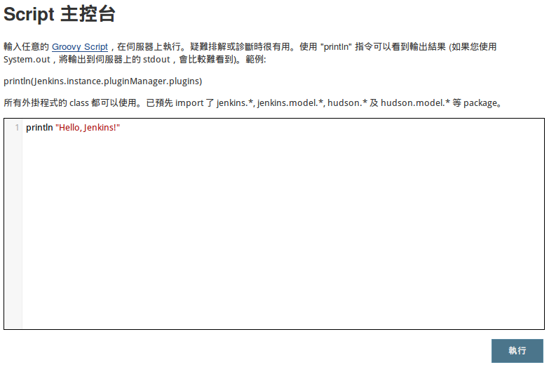

# Task 實作以 Java 為例

Jenkins 提供「Script Console」讓開發者容易撰寫例行性維護的小程式。

開啟方式：管理 Jenkins > Script 主控台



Script Console 支援 Groovy 程式語言，一個最簡單的 Hello World 範例：

```
println "Hello, Jenkins!"
```

按下「執行」就可以看到結果。

範例：利用 Script 檢視（維護）所有 Job 的參數。

```
Hudson.instance.items.each {
  item ->

  prop = item.getProperty(ParametersDefinitionProperty.class)

  if (prop != null) {
    println "--- ${item.name} ---"

    prop.parameterDefinitions.each {
      println "${it.name} ${it.defaultValue} \"${it.description}\""
    }
  }
}
```

Script 可以配合 crontab 等機制定期執行，例如每日（daily）或每小時（hourly），利用 command-line 來執行 Script 的方法如下：

```
curl --data-urlencode "script=$(<script1.groovy)" http://jenkins.local/scriptText
```

備註：必須先將 Script 程式碼儲存為 `script1.groovy`

Script 主要用於 Job / Task 的維護，例如我們想要一次更新數十甚至數百的 Job 的特定參數內容，就可以撰寫 Script 來取代瑣碎的人工作業。

範例：利用 Script 建立新的作業（Job）。

```
Hudson.instance.createProject(FreeStyleProject.class, "free-style-project")
```

Jenkins Script 更多功能可參考 API 文件。

* http://javadoc.jenkins-ci.org/hudson/model/Hudson.html