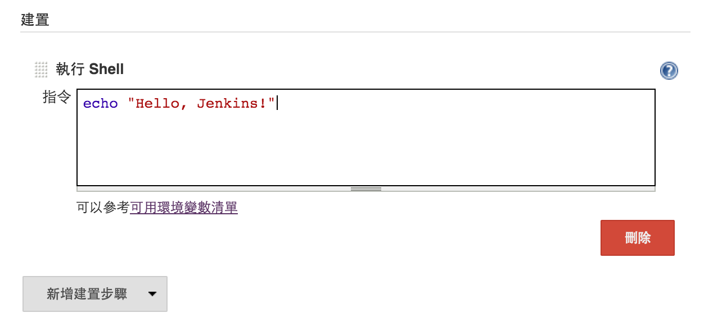

# 執行 Shell 指令

The following variables are available to shell scripts

* BUILD_NUMBER
* BUILD_ID
* BUILD_DISPLAY_NAME
* JOB_NAME
* BUILD_TAG
* EXECUTOR_NUMBER
* NODE_NAME
* NODE_LABELS
* WORKSPACE
* JENKINS_HOME
* JENKINS_URL
* BUILD_URL
* JOB_URL
* SVN_REVISION
* SVN_URL