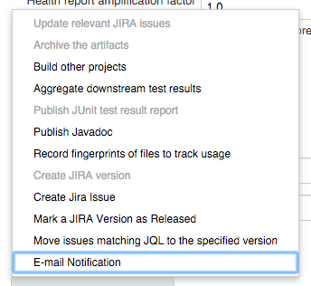
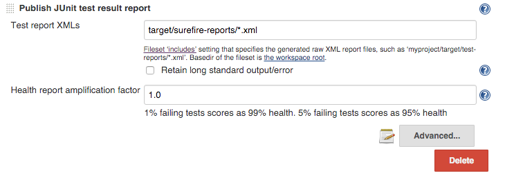
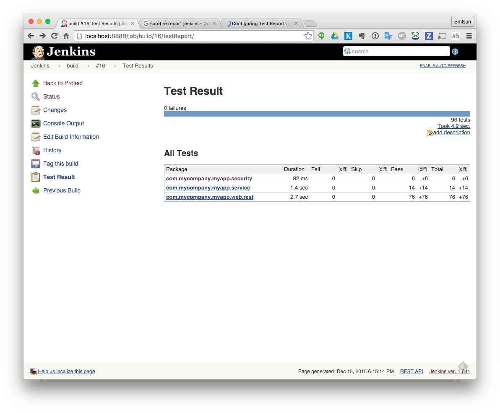

JUnit report
============

設置 task output report
-----------------------

設定讀取 report 位置
--------------------

如上圖所示，將 Test report XMLs 設置為 `target/surefire-reports/*.xml`

檢視 test report
----------------

