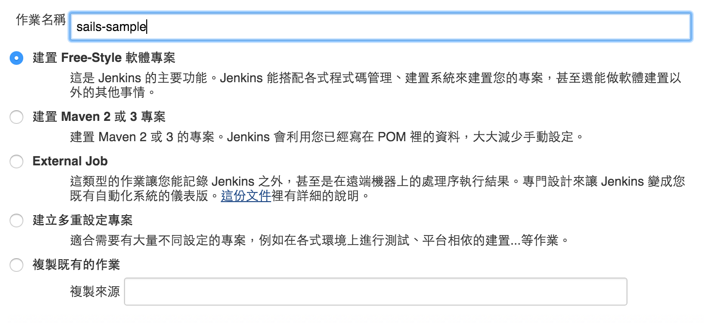
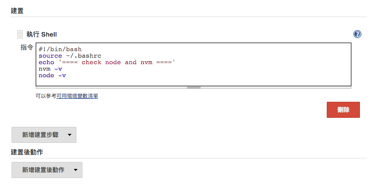
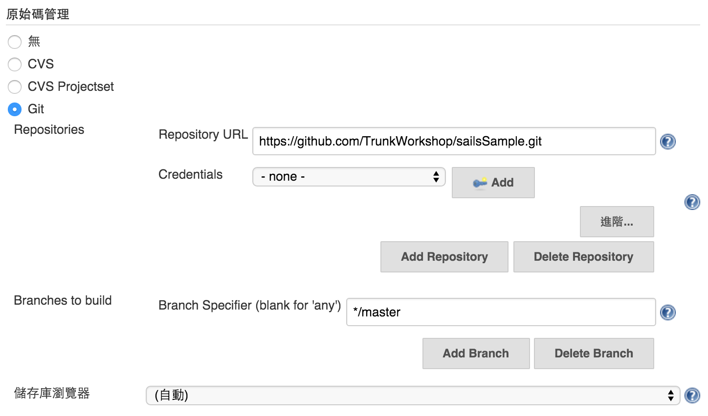
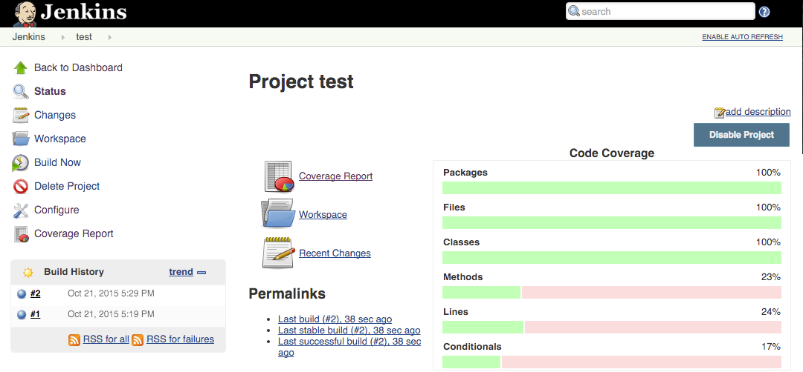

實作：Jenkins + Node.js（上）
===========================

Node.js 用於網站伺服器端應用程式開發，已經愈來愈常見；此範例使用 Node.js + Sails 開發框架，搭配 Jenkins CI 提供自動化建置、測試與部署的實務流程。

建置開發環境
-----------

在終端機先利用 `sudo su - jenkins` 切換成 `jenkins` 系統使用者身份。

### 安裝 NVM

NVM 是用來安裝管理 Node.js 版本的工具。

NVM, Node Version Manager - https://github.com/creationix/nvm

安裝 NVM：

```
touch ~/.bashrc
curl -o- https://raw.githubusercontent.com/creationix/nvm/v0.30.2/install.sh | bash
```

安裝完成後，會在 `~/.bashrc` 增加以下設定。

```
export NVM_DIR="/var/lib/jenkins/.nvm"
[ -s "$NVM_DIR/nvm.sh" ] && . "$NVM_DIR/nvm.sh"  # This loads nvm
```

此段設定主要功能是把 NVM 載入，加入 `~/.bashrc` 就能在 `jenkins` 使用者登入時自動作用到 Shell 執行環境。

如此我們不需要依賴 Jenkins CI 的 Plugins 就能直接使用 `nvm` 指令切換使用不同的 Node.js 版本。

通常在安裝 NVM 之後，需要結束並重新打開終端機的 Shell。如果不想重新再次以 `jenkins` 登入，可以執行 `source ~/.bashrc` 來將 NVM 設定載入當前的 Shell。

如何檢查 NVM 是否能被正常執行？可以透過 `nvm --version` 指令進行確認。

### 安裝 Node.js

使用 `nvm` 指令安裝最新的 Node.js 4.x 版本。

`nvm install v4`

除了可以用 NVM 來安裝 Node.js，它也可以幫助我們管理多個 Node.js 版本，依照專案需求在不同版本之間切換。

如果你要設定某個版本為預設，可以使用以下指令：

`nvm alias default v4`

如果想要確認目前 Node.js 執行的版本，可以用 `-v` 參數：

`node -v`

設定 Jenkins Job
----------------

我們在 Jenkins 的建置步驟，盡可能與實際開發過程保持一致，包括所使用的指令。

安裝完 Node.js 之後，建議在 Jenkins 建立測試專用的 Job，執行 `node -v` 指令來協助確認執行環境是否能正常作業。

選擇「新增作業」建立一個新的 Jenkins Job，作業名稱可以自訂，類型為「建置 Free-Style 軟體專案」。



先增加新的建置步驟，選擇「執行 Shell」。




在「執行 Shell」的指令欄中，輸入一段執行 `nvm` 與 `node` 指令的 Shell Script。

```
#!/bin/bash

source ~/.bashrc

echo === checking nvm and node.js ===

nvm --version
node -v
```

這段 Shell 的執行結果如下：

```
Started by user anonymous
Building in workspace /var/lib/jenkins/jobs/check jenkins environment/workspace
[workspace] $ /bin/bash /tmp/hudson7479596903861655617.sh
=== check node and nvm ===
0.29.0
v1.8.4
Finished: SUCCESS
```

使用「執行 Shell」步驟，需要注意的地方是，盡可能不要使用太過於複雜的 Shell Script，比如數十行甚至上百行的代碼，以免造成不易追蹤的問題；如果有複雜的建置指令，盡可能先寫好獨立的 Script 檔案，放在專案資料夾中一起進行版本控管，在 Jenkins 中保持使用簡單的指令執行。

例如：

```
#!/bin/bash

./scripts/optimize-assets.sh
```

複雜的 Script 代碼，應該寫在 `scripts/optimize-assets.sh`；這樣一來，即使不透過 Jenkins，也能直接執行該 Script 驗證結果。

在 Jenkins 使用過於複雜的 Shell，可能造成日後維護困難的夢靨。

實際上，如果是屬於自動化建置過程需要被執行的任務，通常會在 Buildfile 就定義清楚；而 Script 則是用來執行這些已經事先定義好的建置指令。

進行自動化建置
------------

### 使用時機

1.	Daily or Nightly Build
2.	週期性建置
3.	正式部署前的完整建置

### 取得範例程式碼

此範例使用 Node.js + Sails Framework，可以在 GitHub 取得：

https://github.com/TrunkWorkshop/sailsSample

使用 `git` 指令取得程式碼。

```
git clone https://github.com/TrunkWorkshop/sailsSample.git
```

Jenkins 提供 Git 原始碼管理的整合功能，因此我們可以直接透過 Job 的設定：



### 建置的 Shell 指令

```
#!/bin/bash
source ~/.bashrc
cp -r ~/sailsSample/node_modules/ node_modules
npm i
grunt build
zip -r build.zip ./ > /dev/null
```

在第一次執行時，可能會遇到沒有 `grunt` 指令的問題，此時我們可以在終端機以 `jenkins` 系統使用者的身份，先安裝 `grunt-cli` 套件：

`npm i grunt-cli -g`

重新再執行一次 Job 就能完成建置。

進行自動化測試
------------

搭配 Grunt 進行測試。

```
#!/bin/bash
source ~/.bashrc
npm i
grunt test
```

產生測試覆蓋率報告
----------------

搭配 Cobertura 產生測試覆蓋率報告，產生的檔案位置是：

```
**/coverage/cobertura-coverage.xml
```

執行結果畫面如下：



未完待續
-------

搭配 **Publish Over SSH Plugin**，可以輕鬆地將建置完成的檔案傳輸到遠端伺服器，或是在遠端伺服器執行一段指令，滿足自動化部署的需求⋯