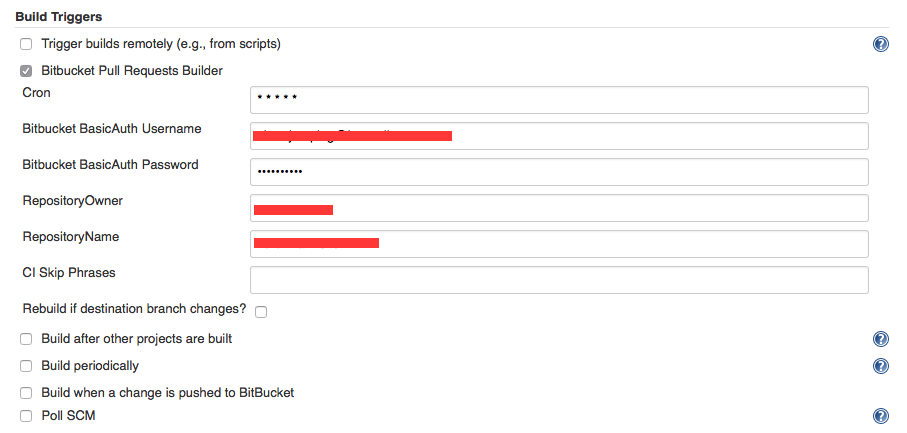

Bitbucket Plugin
================

用於串接 Bitbucket 的套件，可以用來進行：

1.	[pull request trigger](/task/bitbucket-pr-test.md)

設置方式
--------

-	creating a job
	-	New Item: choose "Freestyle project"
	-	Project name: [self pick]
	-	Source Code Management:
		-	choose Git
		-	Repository URL: `git@bitbucket.org:${repositoryOwner}/${repositoryName}.git`
		-	Credentials: select the key add in above 'set credentials' part
		-	Branches to build: `*/${sourceBranch}`
			-	develop is a branch for developing, can be replaced with own branch
	-	Build Triggers
		-	check "Bitbucket Pull Requests Builder"
			-	Cron: * * * * \*
				-	every minute
			-	Bitbucket BasicAuth Username: [self bitbucket email]
			-	Bitbucket BasicAuth Password: [self bitbucket password]
			-	RepositoryOwner: [the username who opened bitbucket repository]
			-	RepositoryName: [the repository name]

