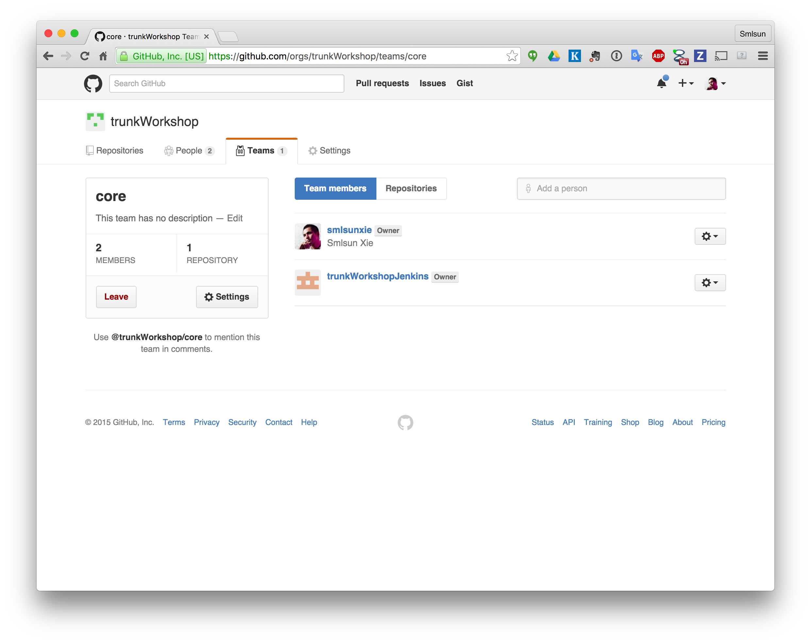
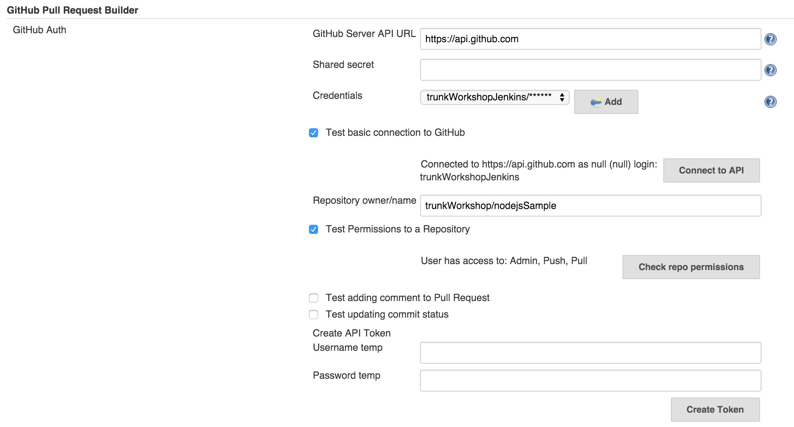
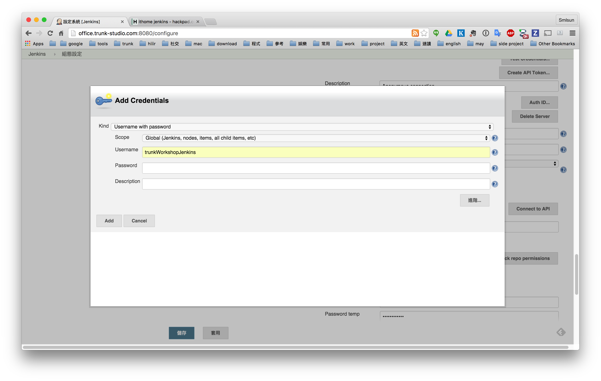
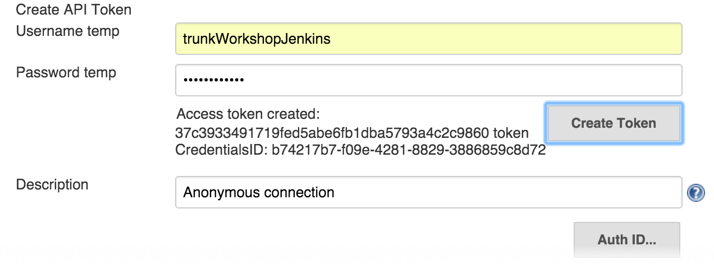
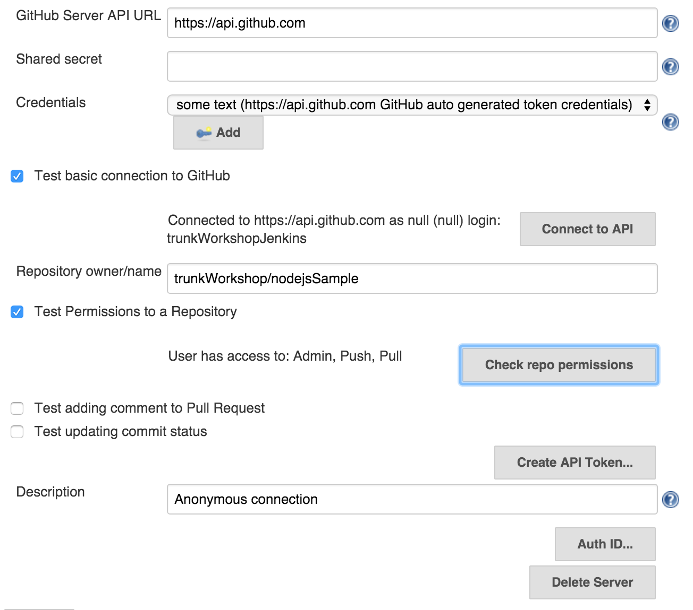
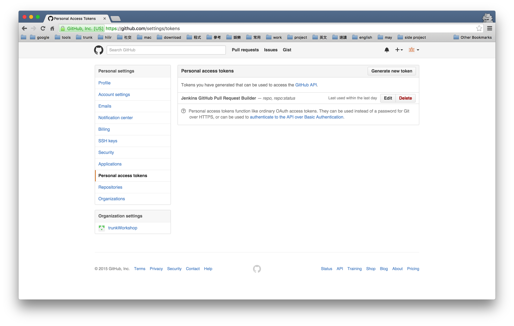

GitHub pull request builder
===========================

使用時機為一旦發布 pull request 時可以自動進行一些對應動作時，如：

1.	發出 pull request 進行自動建置
2.	發出 pull request 進行自動測試

設定 jenkins user as github project owner
-----------------------------------------

設置 github pull request
------------------------

設定 github 登入帳號密碼
------------------------

產生 github access token
------------------------

確認設置狀況
------------

確認 github 已經完成設置
------------------------

