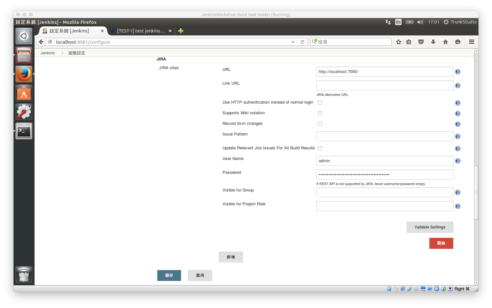
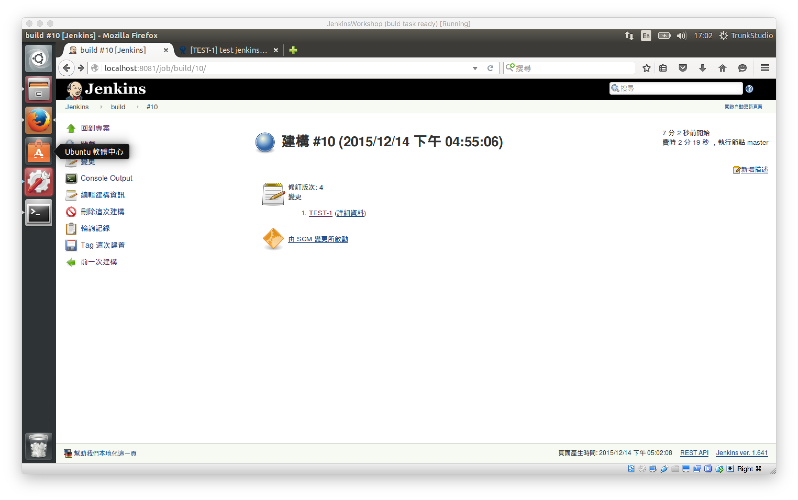
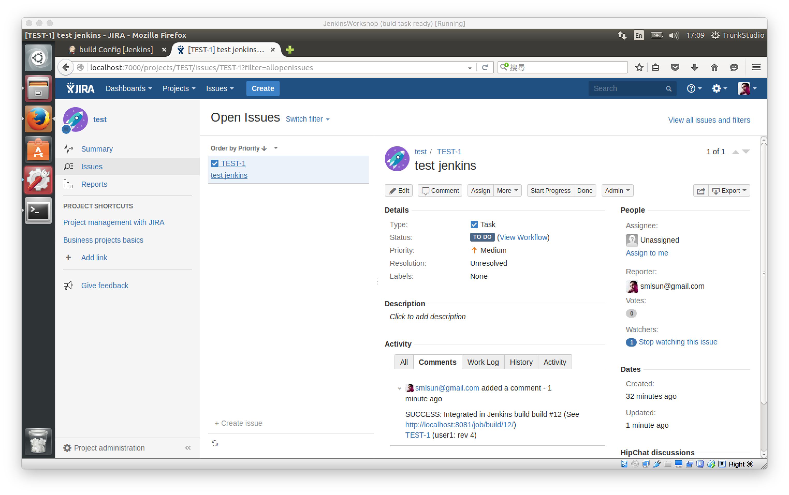

JIRA plugin
===========

jenkins setup
-------------

task setup
----------

commit message
--------------

JIRA plugin 將會根據你的 commit message 直接連結到相關的 JIRA issue

如下圖所示，若已有存在一個 issue 為 `TEST-1`

則可以直接點選 link 進入檢視

update issue
------------

假設你的 commit 中有包含 issue ID，並且在 jenkins setup 有設置使用者帳號與密碼，則 jenkins 將會直接回報 task 執行的狀況到 JIRA issue 的 comments，執行結果如下：

