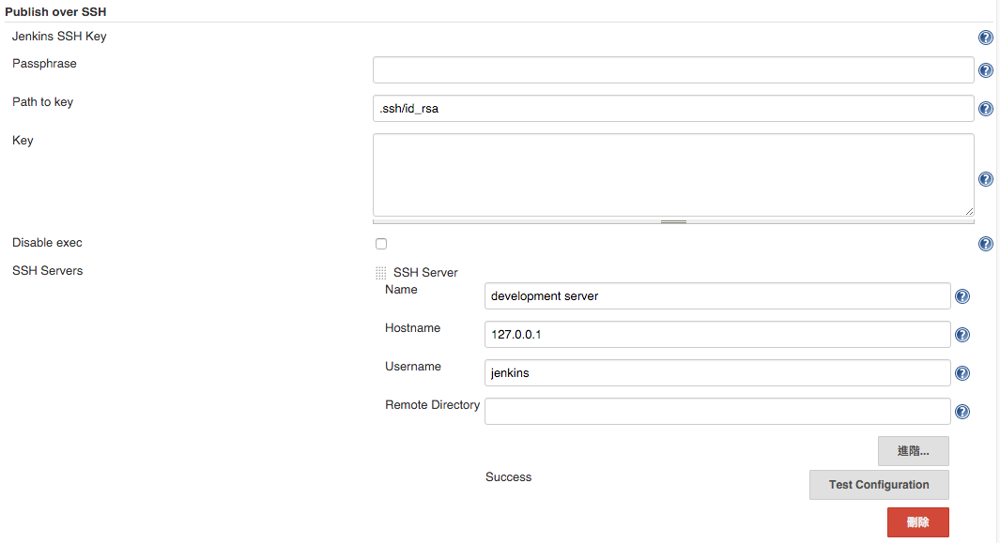

Publish over SSH
================

使用時機：

1.	專案建置完成後需要傳輸到 production 機器時
2.	每日建置完成後需要傳到別台機器進行備份時
3.	檔案傳輸完成後，需要透過遠端機器進行後續指令執行時

使用前準備：建立 ssh key
------------------------

參考 plugin/[ssh](setup/ssh.md) 章節設置好 ssh key

plugin 相關設定
---------------

進入 jenkins 後台設定，移至 `Publish over SSH` 區塊

name 為在 jenkins task 設定時識別名稱 hostname 則為目標機器位置 username 則是你要透過 ssh 登入的使用者帳號 Remote Directory 則是你登入後期望的初始位置，下面是設置的畫面

