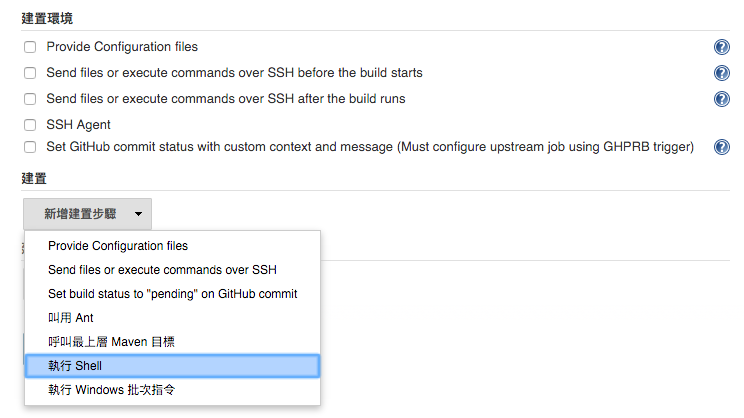

設置建置環境
============

可以使用如：

- [NodeJS Plugin](https://wiki.jenkins-ci.org/display/JENKINS/NodeJS+Plugin)
- [Rvm](https://wiki.jenkins-ci.org/display/JENKINS/RVM+Plugin)

但實務上有可能用了 Node.js Plugin 就會影響 RVM 的運作。

建議的直接使用 jenkins 所設置的 user 把相關的環境設置完成。

確認使用者
----------

通常安裝完 jenkins 時，在 linux 會幫你建立 jenkins user

在 jenkins CI 底下所做的任何事情大多會透過 jenkins user 來做

在終端機中使用 `sudo su jenkins` 可以切換成 `jenkins` 使用者的身份進行各項操作，該 user 的家目錄（Home Directory）位置是 `/var/lib/jenkins`

建立建置環境所需 library
------------------------

### 安裝 nvm

本實戰將會以 NodeJS 為例，因此我們需要先把需要的版本安裝完成，透過 nvm 來進行 NodeJS 安裝，指令如下：

```
touch ~/.bashrc
curl -o- https://raw.githubusercontent.com/creationix/nvm/v0.29.0/install.sh | bash
```

安裝完之後會在 jenkins user 的 `~/.bashrc` 寫入下列指令

```
export NVM_DIR="/var/lib/jenkins/.nvm"
[ -s "$NVM_DIR/nvm.sh" ] && . "$NVM_DIR/nvm.sh"  # This loads nvm
```

這段最主要的用意就是要把 nvm 載入，之所以需要寫入 `~/.bashrc` 就是要在登入時將 nvm 載入。

如此我們就可以再不依賴 jenkins CI 的 plugin 的協助快速的把開發環境所需資源安裝完成。

第一次安裝 nvm，因為我們是在登入後安裝完成，因此並不會執行到上述指令，透過 `source ~/.bashrc` 來載入

我們可以透過 `nvm --version` 確認已確實載入完成

### 安裝 NodeJS

`nvm install iojs-v1.8`

透過 nvm 的協助我們可以很方便進行 NodeJS 版本切換，這也會使我們在建置時可以很方便的切換版本。

如果你要設置某個版本為預設，可以使用下列指令

`nvm alias default iojs-v1.8`

如此我們可以確認一下目前 NodeJS 的版本

`node -v`

到這邊基本上基本環境已經有了

我們可以在 jenkins CI 建立一個 task 確認一下是否可以正確抓到 node

### jenkins CI check environment




```
#!/bin/bash
source ~/.bashrc
echo '==== check node and nvm ===='
nvm --version
node -v
```

執行結果如下：

```
Started by user anonymous
Building in workspace /var/lib/jenkins/jobs/check jenkins environment/workspace
[workspace] $ /bin/bash /tmp/hudson7479596903861655617.sh
==== check node and nvm ====
0.29.0
v1.8.4
Finished: SUCCESS
```

### 不使用 plugin 來安裝相關 library 的好處

除了 task 的執行之外，另外一個原因是，在除錯的過程中讓 jenkins CI 跟 jenkins user 同樣環境設置方式將會有利於加速確認環境是否正確或是有異常時可以直接用 jenkins user 進行 debug

這件事非常重要，因為若都只能用 task 確認，每次確認結果將會比較慢，執行上會比較有挫折感。

相同的，若我們需要新增新的處理，也可以進行直接用 jenkins user 進行，將會更直接的把自動化需求完成，一旦確認沒有問題 理論上再把相關指令讓 jenkins CI 執行就會正確！

TDD 的精神無誤。
