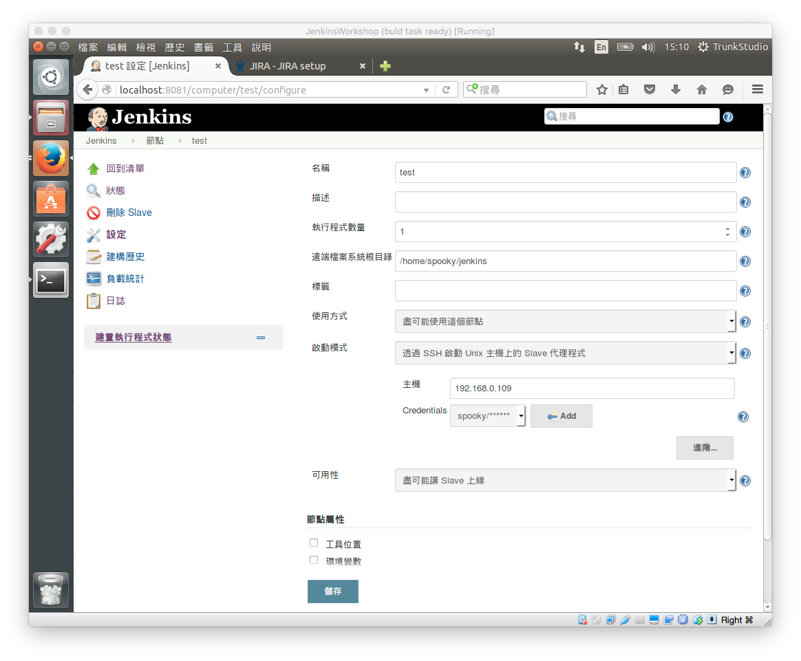

Master/slave
============

節點套件安裝
------------

```
sudo apt-get update
sudo apt-get upgrade
sudo apt-get install default-jre
```

節點使用者設定 ssh
------------------

新增你要用來執行 slave 的 user，e.g. slave

參考 [ssh](./ssh) 進行設定

jenkins slave 設置
------------------



slave 無網路情形
----------------

可以使用 `在 Master 上執行指令啟動 Slave`

參考 jenkins 內的說明

> 啟動 Slave 代理程式的指令，可以控制 Slave 電腦並與 Master 溝通。 Jenkins 假設執行的程式會在正式的 Slave 機器上啟動 slave.jar。
>
> 可以由 http://${jenkinsServerHost}/jnlpJars/slave.jar 下載 slave.jar。
>
> 簡單一點就像 "ssh 主機名稱 java -jar ~/bin/slave.jar"。 但是，一般會建議您在 Slave 上面寫一個小 Shell Script，控制 Java 及 slave.jar 的位置， 也能設定 PATH 這類節點間不盡相同的環境變數。就像:
>
> #!/bin/sh exec java -jar ~/bin/slave.jar
>
> 您可以使用任何指令執行 Slave 機器上的程式，例如 RSH。 只要最後程式的 stdin 及 stdout 被連到 "java -jar ~/bin/slave.jar" 就好。
>
> 大型部署環境下，可以考慮從掛載 NFS 的共通位置中載入 slave.jar， 就不用每次升級 Jenkins 時還要同步更新每部機器上的這個檔案。
>
> 設定成 "ssh -v 主機名稱" 可以幫助您處理連線問題。
