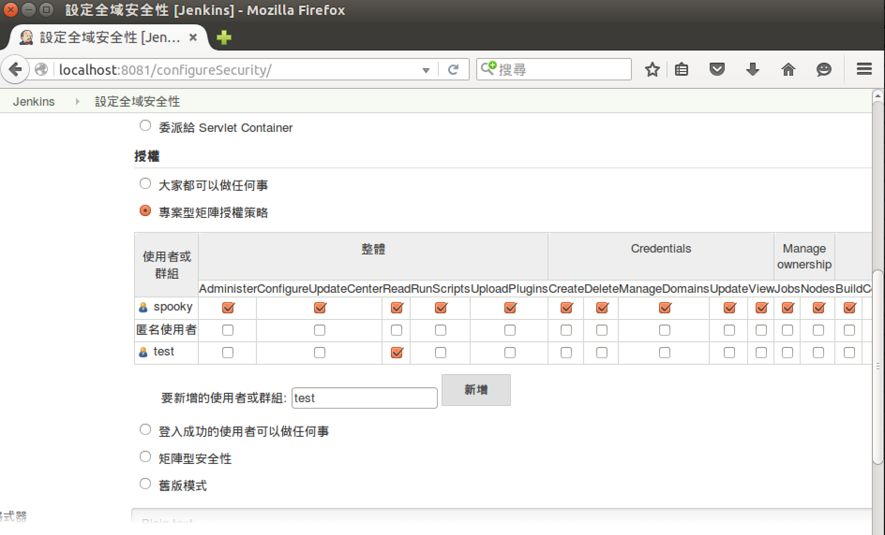
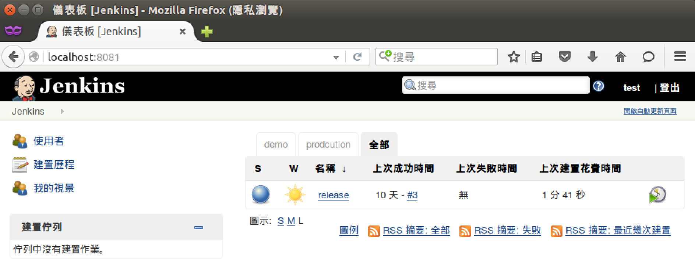

設置安全性
==========

設置畫面
--------

專案型矩陣授權策略
------------------

### 使用時機

希望可以控管特定 task 可被特定人員存取，例如：production deploy 時，只有 DevOps 人員可以進行 release task 的執行

### 設置方式

在 `Jenkins > 設定全域安全性` 使用 `專案型矩陣授權策略` 並且在新增人員至少要有整體 `read` 權限，如下圖：

需要注意的是，若使用者有設置 `整體 Administer` 權限，預設將可以看到所有的 task。

接著，我們可以進入特定 task 進行權限設置，如下圖：

最後再使用 test 這個 user 進行登入後，將只能看到有設置可以存取的 task 被顯示出來

