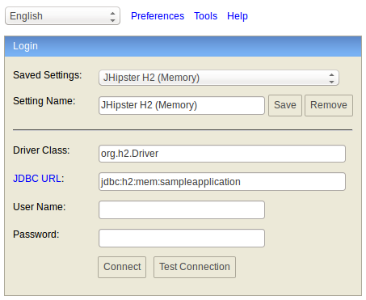
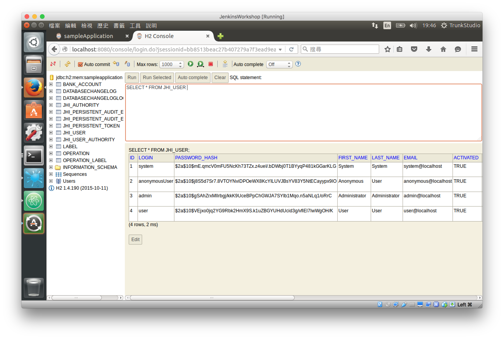

# 初始資料


* src/main/resources/config/application-dev.yml

```
spring:
    profiles:
        active: dev
    datasource:
        driver-class-name: org.h2.jdbcx.JdbcDataSource
        url: jdbc:h2:mem:sampleapplication;DB_CLOSE_DELAY=-1
        name:
        username:
        password:
```

* src/main/resources/config/application-prod.yml

```
spring:
    profiles:
        active: prod
    datasource:
        driver-class-name: com.mysql.jdbc.jdbc2.optional.MysqlDataSource
        url: jdbc:mysql://localhost:3306/sampleApplication?useUnicode=true&characterEncoding=utf8
        name:
        username: root
        password:
```

檢視 H2 Database 的資料，可以利用 H2 Console。

* http://localhost:8080/console/



在 H2 Console 檢視 Table 內容以及利用 SQL 進行查詢。



資料庫初始化資料存放路徑

```
src/main/resources/config/liquibase
```