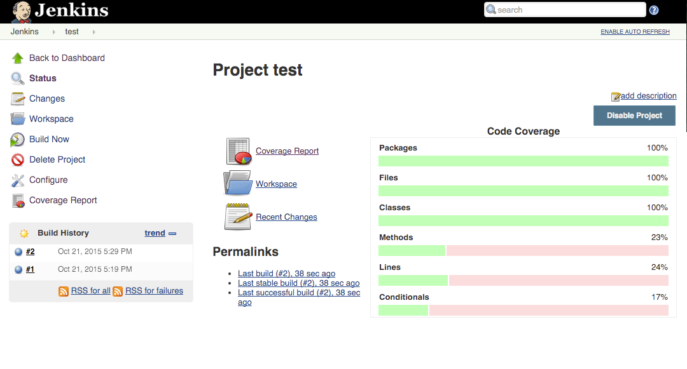

test
====

延續 task/[build](task/build.md)

我們可以建置透過 build task 直接複製如下圖：


建置指令
--------

```
#!/bin/bash
source ~/.bashrc
npm i
grunt test
```

設置 Cobertura 呈現測試覆蓋率
-----------------------------

report 位置：`**/coverage/cobertura-coverage.xml`

執行結果
--------


