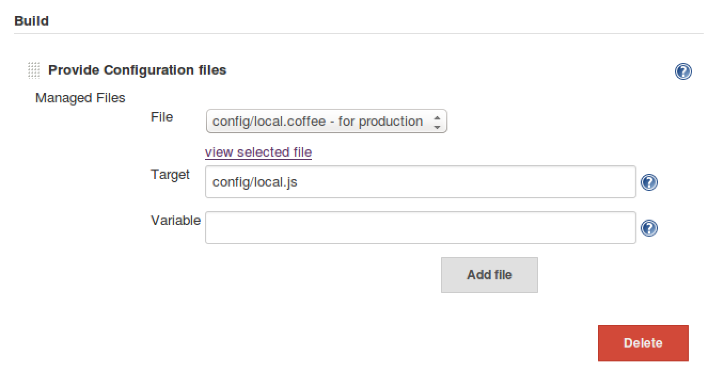

正式機部署
==========

task 設置
---------

基本設置與 task/[preview](preview.md) 基本上是一樣的

因為是 production 環境，所以我們需要將設定改為 production 機器專用

### 替換 Config

使用 [config-file-provider](../plugin/config-file-provider.md)

設定檔內容如下：

```
module.exports = {
  port: 3000
}
```

設置畫面如下：


設置替換位置為 `config/local.js`。



假設 production 機器啟動後 port 為 3000

### ssh publish setup

假設 preview 機器就是 production 機器

-	Name: 選擇在 [publish-over-ssh](../plugin/publish-over-ssh.md) 建置的 ssh server
-	Source files: build.zip
-	Remote directory: deploy/temp

### production release 執行指令

基本指令跟 preview 很像，資料夾是不一樣的

```
rm -rf deploy/release
mkdir -p deploy/release
unzip -o deploy/temp/build.zip -d deploy/release > /dev/null
pm2 kill
pm2 start deploy/release/app.js
```

透過這些 task 的設置就把整個開發流程自動化完成，其實不難。
