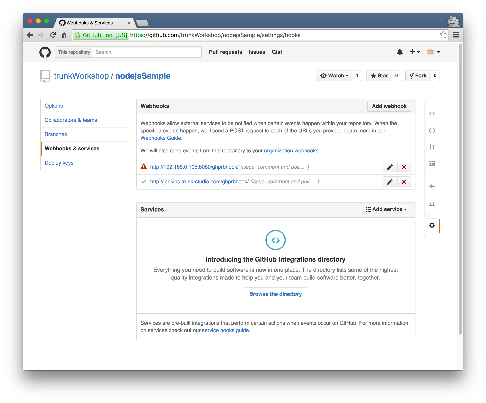

pull request test task
======================

進行此 task 前，需要先將 plugin/[GitHub pull request builder](../plugin/github_pull_request_builder.md) 設置完成

使用 Use github hooks for build triggering
------------------------------------------

### 設置前須確認

需要確認 github 上面的 Repository 之 webhook 是否可以正確連結

你的 jenkins CI 必須要能被外部存取，不然不管怎樣都無法自動啟動

### 設置

設置上需要打開原始碼管理 git 之進階

填入:

-	Name: `origin`
-	refspec: `+refs/pull/*:refs/remotes/origin/pr/*`
-	Branches to build: `${sha1}`

如下圖：

使用輪詢
--------

此方式為定時檢查是否有 pull request 被發出，若有勾選 Use github hooks for build triggering，則此功能將會關閉
